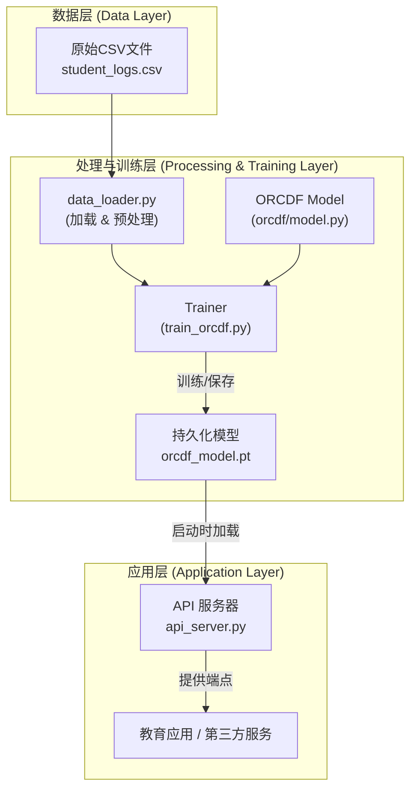

# DKG: ORCDF-based Cognitive Diagnosis Engine

[](./README_zh.md)
[](./README_en.md)

This project provides a backend engine for student cognitive diagnosis based on the **ORCDF (Oversmoothing-Resistant Cognitive Diagnosis Framework)** model. It leverages Graph Neural Networks (GNNs) to predict student performance on exercises, offering a powerful API for real-time diagnostic predictions.

本项目是一个基于 **ORCDF (抗过平滑认知诊断框架)** 模型的学生认知诊断后端引擎。它利用图神经网络 (GNN) 预测学生的习题表现，并提供一个强大的API进行实时诊断预测。

---

## System Architecture / 系统架构



## ✨ Core Features / 核心功能

- **High-Precision Prediction**: Utilizes the advanced ORCDF GNN model to accurately predict student performance.
- **Oversmoothing Resistance**: Employs a specialized architecture and consistency regularization to mitigate the oversmoothing issue common in GNNs, ensuring more distinct student representations.
- **Real-time API**: Offers a high-performance FastAPI backend to serve real-time prediction requests.
- **Scalable Framework**: Built on PyTorch, providing a solid foundation for future extensions and research.

---

## 🚀 Quick Start / 快速开始

1.  **Clone Repository**:
    ```bash
    git clone https://github.com/MuQY1818/DKG.git
    cd DKG
    ```

2.  **Install Dependencies**:
    ```bash
    pip install -r dkg_mvp/requirements.txt
    ```
    
3.  **Train the GNN Model**:
    Before the first run, you must train the ORCDF model and generate the model file.
    ```bash
    # This command will train the model on the full dataset
    # The best model will be saved in the 'models/' directory
    python -m dkg_mvp.train_orcdf
    ```

4.  **Run API Server**:
    ```bash
    python api_server.py
    ```
    Once the server is running, visit `http://127.0.0.1:5000/docs` in your browser to see the interactive API documentation for the new prediction endpoints.

---

## For More Information / 详细信息

For detailed documentation, please choose your preferred language:
要获取更详细的文档，请选择您的语言：

- **[English](./README_en.md)**
- **[简体中文](./README_zh.md)**
- **[Technical Documentation (English)](./TECHNICAL_DOCUMENTATION_en.md)**
- **[技术文档 (中文)](./TECHNICAL_DOCUMENTATION.md)** 