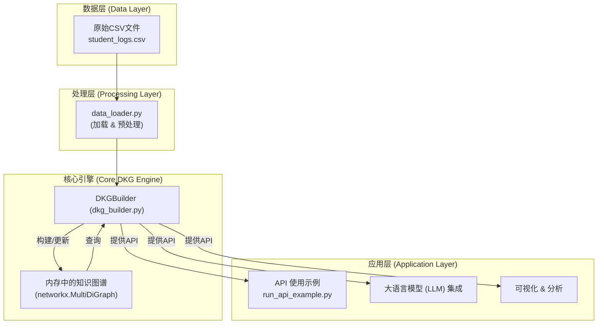

# DKG: Dynamic Knowledge Graph for Student Modeling

[](./README_zh.md)
[](./README_en.md)

This project provides a backend engine for a Dynamic Knowledge Graph (DKG) designed for student modeling. It transforms student interaction log data into a dynamically updated knowledge graph in real-time, offering a powerful Python API for real-time analysis and personalized recommendations.

本项目是一个专为学生建模设计的动态知识图谱（DKG）后端引擎。它能将学生的学习交互日志实时转化为一个动态更新的知识图谱，并提供强大的Python API进行实时分析和个性化推荐。

---

## System Architecture / 系统架构



## ✨ Core Features / 核心功能

- **Dynamic Graph Construction**: Builds a comprehensive knowledge graph from raw student learning data.
- **Real-time Updates**: Updates student knowledge states in real-time based on new learning interactions.
- **Student Profiling**: Provides detailed student profiles, including strengths and weaknesses.
- **Intelligent Recommendations**: Recommends the next practice problems for students based on their weak points.
- **LLM Integration**: Generates structured prompts to provide context for LLMs.

---

## 🚀 Quick Start / 快速开始

1.  **Clone Repository**:
    ```bash
    git clone https://github.com/MuQY1818/DKG.git
    cd DKG
    ```

2.  **Install Dependencies**:
    ```bash
    pip install -r dkg_mvp/requirements.txt
    ```
    
3.  **Download Datasets**:
    Download the required CSV files from the link below and place them in the `dataset/` directory.
    - **[Go to Dataset Download Page](https://github.com/MuQY1818/DKG/releases/tag/dataset)**
    > (从下方链接前往数据集下载页面，将所需CSV文件下载并放入 `dataset/` 目录。)

4.  **Run Example**:
    ```bash
    python run_api_example.py
    ```

---

## For More Information / 详细信息

For detailed documentation, please choose your preferred language:
要获取更详细的文档，请选择您的语言：

- **[English](./README_en.md)**
- **[简体中文](./README_zh.md)**
- **[Technical Documentation (English)](./TECHNICAL_DOCUMENTATION_en.md)**
- **[技术文档 (中文)](./TECHNICAL_DOCUMENTATION.md)** 