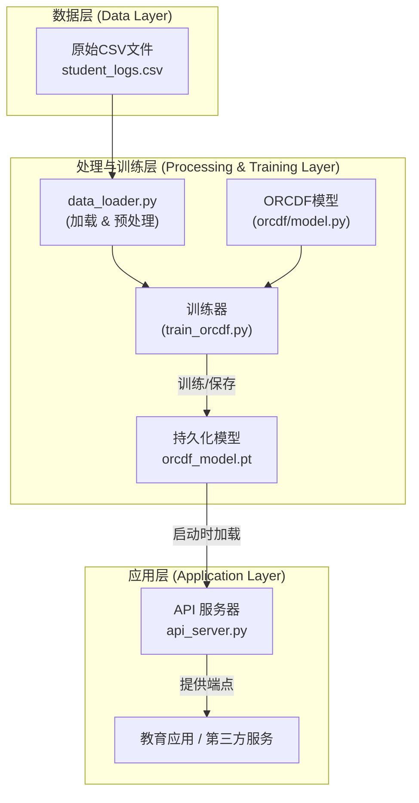

[Read in English](./README_en.md)

# DKG：基于 ORCDF 的认知诊断引擎

本项目是一个基于 **ORCDF (抗过平滑认知诊断框架)** 模型的学生认知诊断后端引擎。它利用图神经网络 (GNN) 预测学生的习题表现，并提供一个强大的API进行实时诊断预测。

---

## 🚀 快速开始

### 1. 安装

首先，克隆本仓库并安装所需的依赖包。

```bash
git clone https://github.com/MuQY1818/DKG.git
cd DKG
pip install -r dkg_mvp/requirements.txt
```

### 2. 训练GNN模型 (首次运行)

在启动服务器前，您必须先训练ORCDF模型以生成模型文件。

```bash
# 此命令将在完整数据集上训练模型
# 表现最佳的模型将被保存在 'models/' 目录下
python -m dkg_mvp.train_orcdf
```

### 3. 启动API服务器

执行以下命令来启动后端API服务：

```bash
python api_server.py
```

服务器启动后，在浏览器中打开 **`http://127.0.0.1:5000/docs`** 即可访问为新预测端点设计的交互式API文档。

---

## ✨ 核心功能

- **高精度预测**: 利用先进的 ORCDF GNN 模型准确预测学生表现。
- **抗过平滑**: 采用专门的架构和一致性正则化来缓解GNN中常见的过平滑问题，确保学生表征更具区分度。
- **实时API**: 提供一个高性能的FastAPI后端，为实时预测请求提供服务。
- **可扩展框架**: 基于PyTorch构建，为未来的功能扩展和研究提供了坚实的基础。

## 🏛️ 系统架构



## 🛠️ API 参考

所有核心功能都通过FastAPI服务暴露。要了解详细的端点、参数和请求/响应格式，**强烈推荐直接查阅服务器启动后提供的交互式API文档 (`/docs`)**。

### 核心API端点

- **`POST /api/predict`**: 接收一个或多个学生-练习交互，并预测其答对的概率。
- **`GET /api/status`**: 检查服务健康状况和模型加载状态。